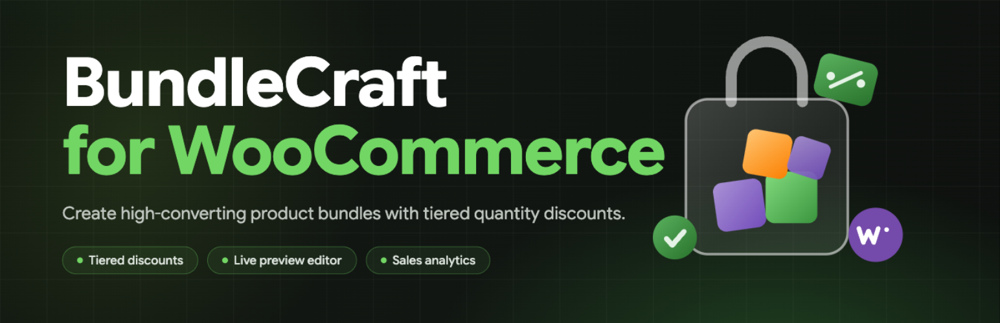
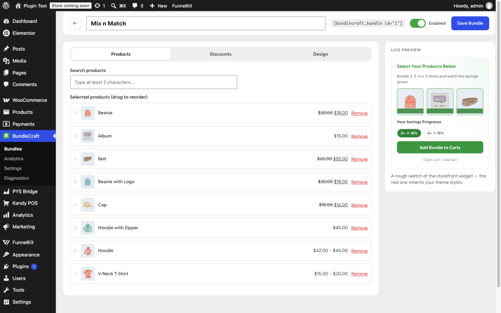
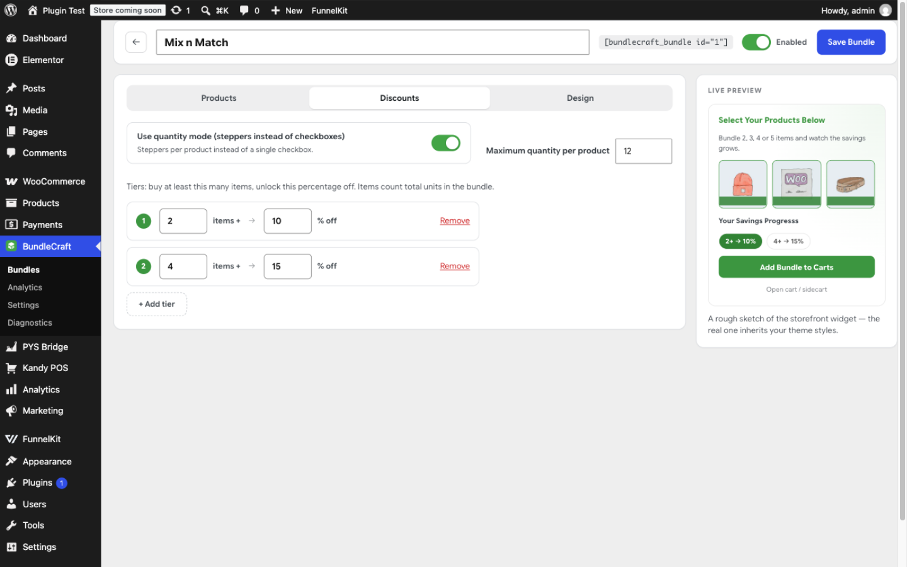
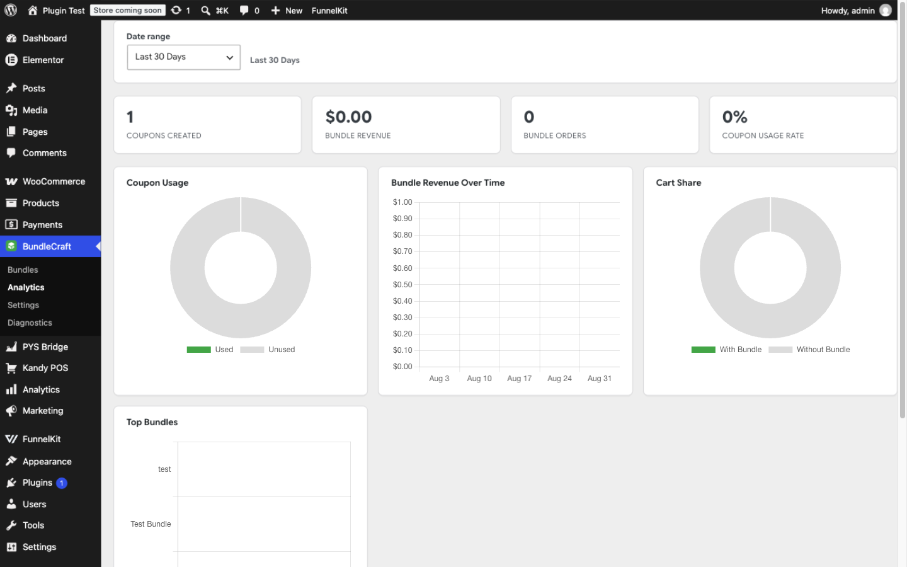
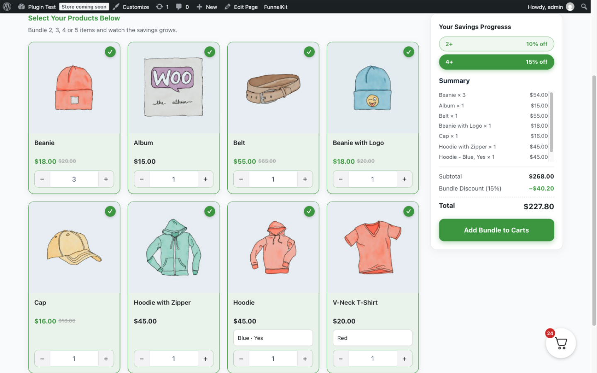

# BundleCraft for WooCommerce



**[⬇ Download the latest release](../../releases/latest)** — install via **Plugins → Add New → Upload Plugin**.

Build product bundle promotions with tiered quantity discounts, a modern Vue-powered admin, analytics, and a customer-facing bundle builder widget.

- **Contributors:** ashawkat
- **Author:** Betatech
- **Requires:** WordPress 6.0+, WooCommerce 7.0+, PHP 7.4+
- **License:** GPL-2.0-or-later

## Features

- Bundle editor admin app (Vue 3) with product search, drag-and-drop ordering, tiered quantity discounts, text/color controls, and a live preview.
- **Gutenberg block** (`bundlecraft/bundle`) with an in-editor preview and automatic shortcode → block conversion, plus the classic `[bundlecraft_bundle id="…"]` shortcode.
- Storefront widget: variation support, quantity steppers or select mode, tier progress, summary, and a mobile sticky cart.
- Server-authoritative pricing: the browser never computes discounts. Quotes and cart additions go through the WordPress REST API, and the discount is applied as a real WooCommerce coupon.
- Analytics dashboard (coupon usage, revenue over time, cart share, top bundles) with date-range filtering.
- Diagnostics page and optional WooCommerce debug logging.
- Automatic migration from the legacy "mmb" table of the author's earlier bundle plugin.

> **Roadmap:** first-class widgets for Elementor, Bricks, and other page builders are coming soon.

## Screenshots

| | |
|---|---|
|  |  |
|  |  |

1. Bundle editor with product picker, drag-and-drop ordering, and a live preview of the storefront widget.
2. Tiered discount builder.
3. Analytics dashboard with date-range filtering.
4. Storefront bundle widget with tier progress and live totals.

## Database

The plugin creates **one custom table** on activation — `{$wpdb->prefix}bundlecraft_bundles` (e.g. `wp_bundlecraft_bundles`) — and stores everything else in standard WordPress/WooCommerce tables and options. Schema changes are version-tracked through the `bundlecraft_db_version` option and applied with `dbDelta()`.

### `bundlecraft_bundles`

| Column | Type | Purpose |
|---|---|---|
| `id` | mediumint(9), PK, auto-increment | Bundle ID (used by the block/shortcode) |
| `name` | varchar(255) | Bundle name |
| `description` | longtext | Optional description shown on the storefront |
| `enabled` | tinyint(1) | 1 = published, 0 = hidden |
| `use_quantity` | tinyint(1) | 1 = quantity steppers, 0 = checkbox selection |
| `max_quantity` | int | Maximum units allowed per product |
| `discount_tiers` | longtext | JSON array: `[{"quantity": 2, "discount": 10}, …]` |
| `product_ids` | longtext | JSON array of WooCommerce product IDs in the bundle |
| `heading_text` | varchar(255) | Storefront heading above the product grid |
| `hint_text` | varchar(255) | Helper line under the heading |
| `primary_color` | varchar(7) | Hex color — progress gradient start |
| `accent_color` | varchar(7) | Hex color — borders, prices, pills, button |
| `hover_bg_color` | varchar(7) | Hex color — selected-card tint |
| `hover_accent_color` | varchar(7) | Hex color — button hover, gradient end |
| `button_text_color` | varchar(7) | Hex color — text on accent surfaces |
| `button_text` | varchar(255) | Add-to-cart button label |
| `progress_text` | varchar(255) | Savings-progress section title |
| `cart_behavior` | varchar(20) | `sidecart` or `redirect` |
| `show_bundle_title` | tinyint(1) | Show the bundle name |
| `show_bundle_description` | tinyint(1) | Show the description |
| `show_heading_text` | tinyint(1) | Show the storefront heading |
| `show_hint_text` | tinyint(1) | Show the hint line |
| `show_progress_text` | tinyint(1) | Show the savings-progress block |
| `created_at` / `updated_at` | datetime | Timestamps |

### Stored elsewhere

| Location | Key / pattern | Purpose |
|---|---|---|
| `wp_options` | `bundlecraft_settings` | Plugin settings (logging, default cart behavior, coupon lifetime) |
| `wp_options` | `bundlecraft_db_version` | Schema version for `dbDelta()` upgrades |
| `wp_options` | `bundlecraft_legacy_migrated` | One-time flag for legacy data migration |
| `wp_posts` | `shop_coupon` posts titled `bundlecraft_bundle_*` | Dynamic discount coupons — expire after the configured lifetime; unused ones are deleted by a daily cron |
| Cart item meta | `bundlecraft_bundle_item`, `bundlecraft_bundle_id` | Marks cart lines that belong to a bundle |
| WC session | `bundlecraft_bundle_discount` | Active bundle discount + coupon code for the current shopper |

Uninstalling removes all of the above (table, options, and unused bundle coupons).

## Repository layout

```
bundlecraft-for-woocommerce.php   Plugin bootstrap (header, constants, autoloader, hooks)
includes/                         PHP classes (namespace BundleCraft\)
  class-plugin.php                  Orchestrator: menus, enqueues, page shells
  class-install.php                 Schema, upgrades, legacy migration
  class-bundles.php                 Bundle CRUD + tier logic
  class-rest.php                    bundlecraft/v1 REST routes (admin + storefront)
  class-cart.php                    Dynamic coupon engine + cart hooks
  class-analytics.php               Dashboard queries
  class-frontend.php                Product/bundle payloads + widget rendering
  class-shortcode.php               [bundlecraft_bundle]
  class-settings.php                Option-backed settings
templates/bundle-display.php      Widget shell (payload + mount point)
src/                              Vue 3 sources (admin app, storefront widget)
scripts/build.mjs                 Vite build (two standalone IIFE bundles + CSS)
assets/build/                     Compiled bundles (committed, used by the plugin)
assets/fonts/                     Google Sans Flex (OFL) + license
assets/img/                       Admin menu icon
.wordpress-org/                   WordPress.org directory assets: banners, icon, logo SVG
languages/                        Translations (bundlecraft-for-woocommerce.pot)
```

## Development

```
npm install
npm run build      # production build into assets/build/
npm run dev        # watch mode
```

The two entry points are built as self-contained IIFE bundles (no shared chunks, no ES-module imports) so WordPress can enqueue them directly.

## Releasing a distribution zip

```
npm run build
wp dist-archive . bundlecraft-for-woocommerce.zip
```

`.distignore` excludes development files (`src/`, `node_modules/`, configs) from the archive.

## Security model

- Admin REST routes require `manage_options` via `permission_callback` and the REST nonce.
- Storefront routes validate and sanitize every argument server-side; the discount amount is always recomputed from live product prices before the coupon is created.
- Dynamic coupons are restricted to the bundle's products, expire after 24 hours, and unused ones are garbage-collected daily.
